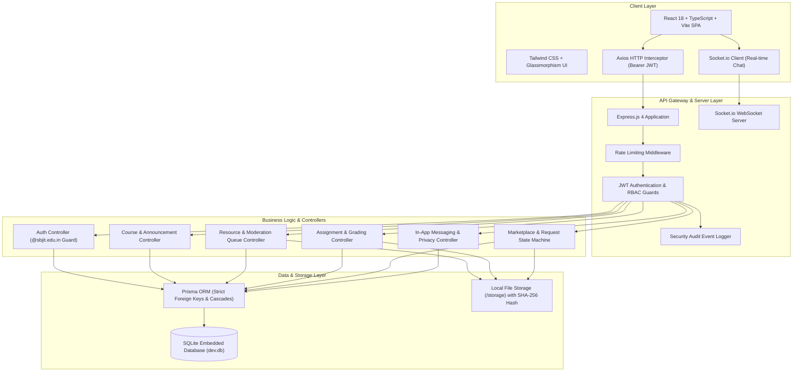
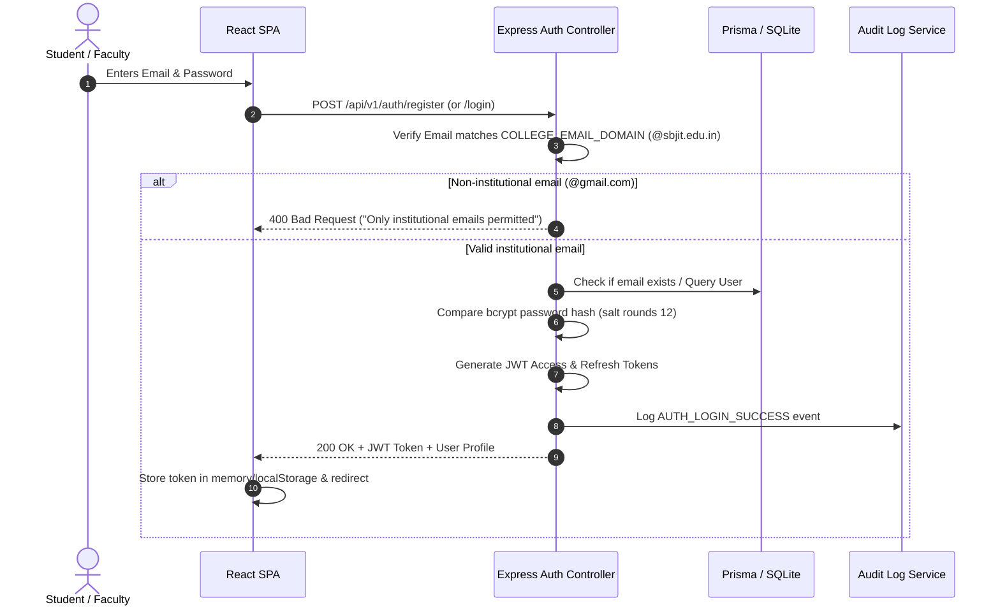
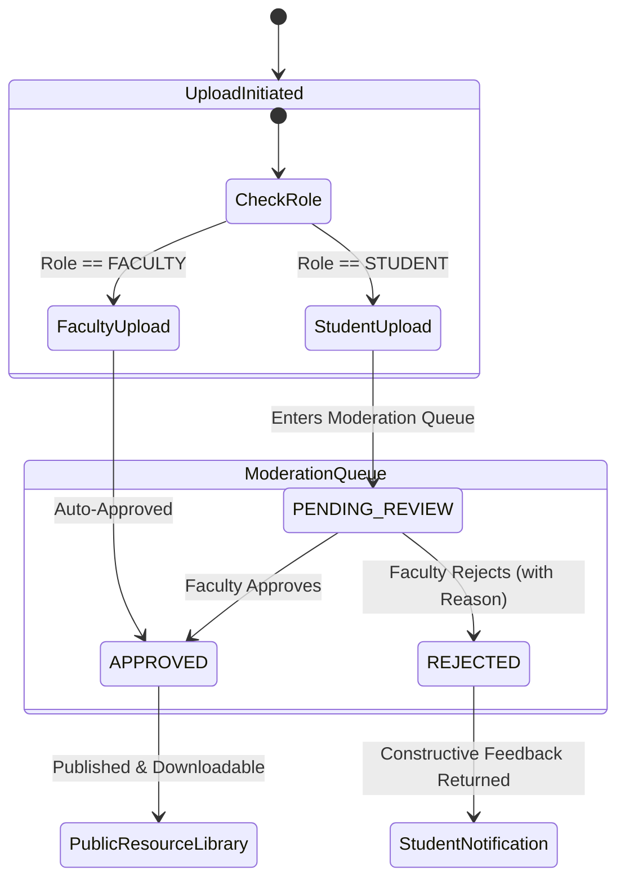
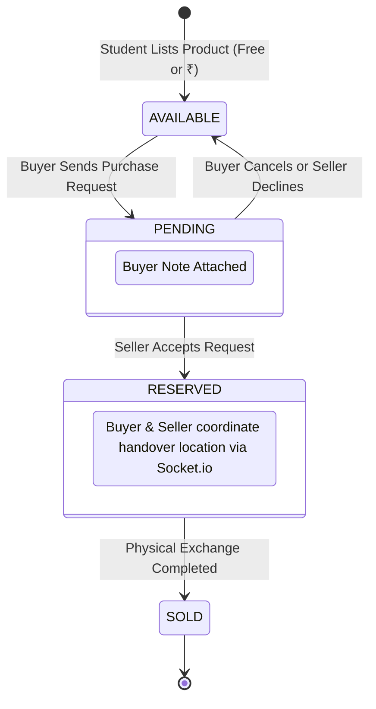

# 🏛️ Architecture & System Design Document

**Project**: Smart Campus Intelligence System  
**Phase**: Phase 1 MVP (Authentication, Academic Hub & Learning Management, Campus Marketplace)  
**Author**: Lead Systems Architect  

---

## 1. Architectural Philosophy & Strategy

The Smart Campus Intelligence System is engineered around three guiding principles:

1. **Strict Institutional Data Sovereignty**: All data, identities, study documents, and communications remain strictly inside the institutional boundary.
2. **Zero Recurring Infrastructure & Vendor Costs (₹0 Cost)**: The architecture avoids all fee-based cloud services (e.g. Auth0, Clerk, SendGrid, Amazon S3, Pusher, Stripe) in favor of resilient open-source foundations (Prisma + SQLite, local storage with SHA-256 deduplication, self-hosted Socket.io).
3. **Defense-in-Depth Security**: Role-based access control (RBAC), parameter validation via Zod, path-traversal prevention, SHA-256 integrity verification, IDOR security guards, and immutable audit logs.

---

## 2. High-Level System Architecture

---

## 3. Core Subsystems & Workflows

### 3.1. Authentication & Institutional Domain Validation

---

### 3.2. Academic Hub: Quality-Controlled Moderation Pipeline

---

### 3.3. Campus Marketplace: Zero-Cost Handover State Machine

---

## 4. Security & Isolation Architecture

1. **In-App Privacy Shield**:
   - Marketplace listings and chat threads only expose the student's name, department, and semester.
   - Raw personal contact details (personal phone number, private email) are never leaked in public API responses.
2. **IDOR (Insecure Direct Object Reference) Prevention**:
   - Verified through automated tests: Students cannot modify or delete listings created by other students.
   - Students cannot approve moderation items or grade assignments.
3. **Local File Storage Security**:
   - File uploads are verified by MIME type and extension whitelisting.
   - Filenames are sanitized and prepended with cryptographically random identifiers to prevent directory traversal (`../`) attacks.
   - Files are stored in dedicated category subdirectories (`storage/resources/`, `storage/assignments/`, `storage/marketplace/`).

---

## 5. Technology Stack Specifications

| Layer | Technology | Rationale |
| :--- | :--- | :--- |
| **Backend Runtime** | Node.js (v20+) | High concurrency, native async/await, low resource footprint |
| **Framework** | Express.js 4 + TypeScript | Standardized routing, robust middleware ecosystem |
| **Database ORM** | Prisma 5 | Type-safe schema, automated migrations, relational querying |
| **Database Engine** | SQLite (Embedded) | Zero configuration, zero external daemon, high performance |
| **Realtime WebSockets** | Socket.io 4 | JWT-authenticated room-based pub/sub for chat & notifications |
| **Validation** | Zod | Runtime schema validation with typed error formatting |
| **Frontend Framework** | React 18 + Vite 5 + TypeScript | Lightning-fast HMR, SPA architecture, zero bundle bloat |
| **Styling** | Tailwind CSS v4 + Vanilla CSS | Modern dark slate palette, glassmorphism card elevation |
| **Icons** | Lucide React | Clean, modern feather icon set |
| **Test Runner** | Vitest + Supertest | Blazing fast in-memory execution, native ESM/TS support |
