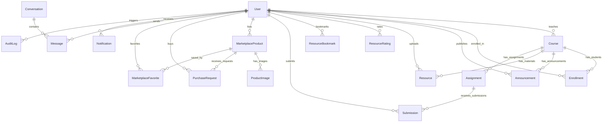

# 🗄️ Database Schema & Relational Models (Prisma ORM)

**Engine**: SQLite (`dev.db`)  
**ORM**: Prisma 5  
**Data Integrity**: Foreign Keys Enforced with Cascades  

---

## 1. Entity-Relationship Diagram (ERD)

---

## 2. Model Definitions & Specifications

### 2.1. User & Identity
- **`User`**: Core user record (`id`, `email` [UNIQUE], `passwordHash`, `role` [`STUDENT`, `FACULTY`, `ADMIN`], `fullName`, `department`, `semester`, `avatarUrl`, `isActive`, `isVerified`).
- **`AuditLog`**: Immutable security stream (`id`, `userId`, `action`, `resourceType`, `resourceId`, `ipAddress`, `details`, `createdAt`).
- **`Notification`**: Institutional user notifications (`id`, `userId`, `title`, `message`, `type`, `link`, `isRead`, `createdAt`).

### 2.2. Academic Hub & LMS
- **`Course`**: Academic classroom (`id`, `courseCode` [UNIQUE], `title`, `description`, `department`, `semester`, `academicYear`, `facultyId`).
- **`Enrollment`**: Student enrollment map (`id`, `courseId`, `studentId`, `enrolledAt`).
- **`Announcement`**: Course broadcasts (`id`, `courseId`, `authorId`, `title`, `content`, `createdAt`).
- **`Resource`**: Study documents (`id`, `courseId`, `uploaderId`, `uploaderRole`, `title`, `description`, `category` [`NOTES`, `PYQ`, `STUDENT_GUIDE`, `ASSIGNMENT_REF`, `REFERENCE_MATERIAL`], `subjectCode`, `department`, `semester`, `filePath`, `fileName`, `fileSize`, `mimeType`, `status` [`APPROVED`, `PENDING_REVIEW`, `REJECTED`], `rejectionReason`, `downloadsCount`, `viewsCount`).
- **`ResourceRating`**: User rating toggle (`id`, `resourceId`, `userId`, `isHelpful`).
- **`ResourceBookmark`**: User saved bookmark (`id`, `resourceId`, `userId`).
- **`Assignment`**: Course coursework (`id`, `courseId`, `facultyId`, `title`, `description`, `maxMarks`, `dueDate`, `allowLate`).
- **`Submission`**: Student deliverable (`id`, `assignmentId`, `studentId`, `submissionText`, `filePath`, `fileName`, `fileSize`, `isLate`, `status` [`SUBMITTED`, `GRADED`, `RETURNED`], `marksAwarded`, `facultyFeedback`, `submittedAt`).

### 2.3. Campus Marketplace & Real-Time Chat
- **`MarketplaceProduct`**: Listed item (`id`, `sellerId`, `title`, `description`, `category` [`TEXTBOOK`, `CALCULATOR`, `LAB_COAT`, `STATIONERY`, `ELECTRONICS`, `HOSTEL_ITEM`, `SPORTS`, `ACADEMIC_MATERIAL`, `OTHER`], `price` [0 for Free], `condition` [`NEW`, `LIKE_NEW`, `GOOD`, `USED`, `HEAVILY_USED`], `status` [`AVAILABLE`, `RESERVED`, `SOLD`], `campusInfo`, `viewsCount`).
- **`ProductImage`**: Photos (`id`, `productId`, `imagePath`, `isPrimary`, `orderIndex`).
- **`PurchaseRequest`**: Physical handover request (`id`, `productId`, `buyerId`, `sellerId`, `status` [`PENDING`, `ACCEPTED`, `COMPLETED`, `REJECTED`, `CANCELLED`], `message`, `createdAt`).
- **`MarketplaceFavorite`**: Wishlist saved item (`id`, `productId`, `userId`).
- **`Conversation`**: Private direct messaging thread (`id`, `user1Id`, `user2Id`, `productId`, `lastMessageAt`).
- **`Message`**: Chat message (`id`, `conversationId`, `senderId`, `content`, `isRead`, `createdAt`).
- **`Report`**: Safety flags (`id`, `reporterId`, `targetType` [`PRODUCT`, `MESSAGE`, `USER`], `targetId`, `reason`, `status`).
- **`BlockedUser`**: Chat blocklist (`id`, `blockerId`, `blockedId`).
