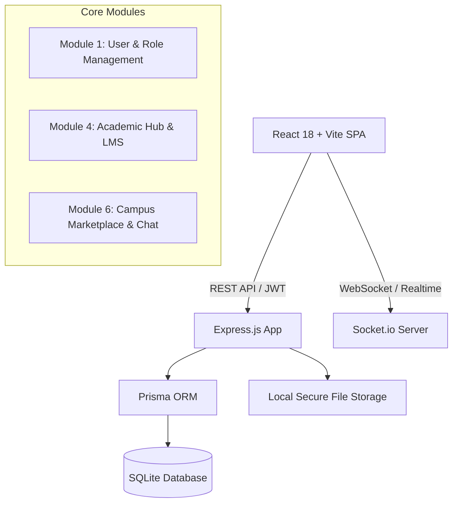

# 🎓 Smart Campus Intelligence System

> **A Student-Centric Digital Service, Intelligence & Decision-Support Platform**  
> *Phase 1 — Production-Quality MVP: Authentication + Academic Hub + Campus Marketplace*

---

## 🌟 Executive Summary

The **Smart Campus Intelligence System** is an institutional digital ecosystem specifically designed to empower students and faculty. Unlike generic legacy ERP software, this platform is focused on:

1. **Institutional Trust & Identity Security**: Enforcing verifiable institutional domain access (`@sbjit.edu.in`) with role-based segregation (`STUDENT`, `FACULTY`, `ADMIN`).
2. **Academic Collaboration & Learning Management**: Dedicated course workspaces, broadcast announcements, assignments with rubric grading, and a **peer-to-peer study material review & moderation pipeline**.
3. **Campus Marketplace**: An institutional student-to-student exchange with zero transaction/gateway fees, **privacy-preserving in-app messaging** (eliminating personal phone/email leaks), and secure physical handover lifecycles.
4. **₹0 Infrastructure Cost**: Built entirely with production-grade open-source technologies (Node.js, Express, SQLite via Prisma ORM, Socket.io, React, Tailwind CSS) without paid third-party dependencies (no Auth0, Clerk, SendGrid, AWS S3, or Stripe).

---

## 🚀 Quick Start & 1-Minute Launch

### 1. Prerequisites
- **Node.js** 18+ or 20+
- **npm** 9+

### 2. Backend Setup
```bash
cd backend
npm install
npx prisma db push
npm run seed
npm run dev
```
*Backend server runs on `http://localhost:5000` with WebSocket support.*

### 3. Frontend Setup
```bash
cd frontend
npm install
npm run dev
```
*Frontend web application runs on `http://localhost:5173`.*

---

## 🔑 Demo Accounts (Pre-Seeded)

| Role | Name | Institutional Email | Password | Department |
| :--- | :--- | :--- | :--- | :--- |
| **Faculty** | Prof. Sarah Jenkins | `faculty1@sbjit.edu.in` | `Password@123` | Computer Science & Engineering |
| **Student (6th Sem)** | Alex Rivera | `student1@sbjit.edu.in` | `Password@123` | Computer Science & Engineering |
| **Student (4th Sem)** | Rohan Sharma | `student2@sbjit.edu.in` | `Password@123` | Information Technology |

> 💡 **Quick Login**: The Login Page features **1-Click Demo Buttons** for instant access without manual typing.

---

## 🏗️ Architecture & Modules (Phase 1 MVP)



### Module 1: User & Role Management
- **Institutional Domain Validation**: Configurable `COLLEGE_EMAIL_DOMAIN` (default: `sbjit.edu.in`). Rejects personal email providers (`@gmail.com`, `@yahoo.com`, `@outlook.com`).
- **Cryptographic Security**: Strong `bcryptjs` hashing (12 rounds) and JWT authentication with expiration.
- **Role-Based Access Control (RBAC)**: Route-level guards for `STUDENT`, `FACULTY`, and `ADMIN`.
- **Immutable Audit Logging**: Every critical action (logins, uploads, moderation approvals, status changes) is logged with timestamp, user ID, IP address, and payload.

### Module 4: Academic Hub & Learning Management
- **Course Portals**: Course syllabus, code, semester grouping, and active student enrollments.
- **Broadcast Announcements**: Faculty post course announcements with instant notification delivery.
- **Quality-Moderated Study Hub**:
  - Faculty uploads are **immediately published**.
  - Student uploads (lecture notes, solved PYQs, study guides) enter the **Faculty Moderation Queue** with `PENDING_REVIEW` status.
  - Faculty inspect previews and **Approve** or **Reject** (with mandatory constructive feedback).
- **Assignments & Grading**: File uploads, solution notes, deadline tracking, late submission detection, faculty rubric scoring, and qualitative feedback.

### Module 6: Campus Marketplace & In-App Chat
- **Zero-Cost Campus Listings**: Textbooks, scientific calculators, lab coats, hardware kits, hostel gear.
- **Privacy-Preserving In-App Chat**: Direct buyer-seller conversations over Socket.io without exchanging phone numbers.
- **Zero-Cost Handover State Machine**:
  $$\text{AVAILABLE} \xrightarrow{\text{Buyer Request}} \text{PENDING} \xrightarrow{\text{Seller Accept}} \text{RESERVED} \xrightarrow{\text{Physical Handover}} \text{SOLD}$$
- **Safety Reporting**: Report flagged listings to campus administrators.

---

## 🧪 Automated Testing

The backend includes a comprehensive Vitest test suite covering authentication, RBAC, IDOR security guards, moderation, and the marketplace lifecycle:

```bash
cd backend
npm test
```

### Test Suite Results
```
 ✓ tests/security_idor.test.ts (6 tests)
 ✓ tests/auth.test.ts          (8 tests)
 ✓ tests/marketplace.test.ts   (7 tests)
 ✓ tests/academic.test.ts      (6 tests)

Test Files  4 passed (4)
     Tests  27 passed (27)
```

---

## 📁 Repository Structure

```
cc/
├── backend/
│   ├── prisma/
│   │   ├── schema.prisma       # Database schema (18 models)
│   │   └── seed.ts             # Demo data seeder
│   ├── src/
│   │   ├── config/             # Environment configuration
│   │   ├── controllers/        # Express controllers (Auth, Course, Resource, Assignment, Market, Chat)
│   │   ├── middleware/         # JWT auth, RBAC, rate limiter, error handler
│   │   ├── routes/             # REST API routes
│   │   ├── services/           # Prisma, Socket.io, Audit, File Storage
│   │   ├── app.ts              # Express application setup
│   │   └── server.ts           # HTTP & Socket.io server entry
│   ├── storage/                # Safe local uploads (deduplicated SHA-256)
│   ├── tests/                  # Automated integration test suites
│   └── package.json
│
├── frontend/
│   ├── src/
│   │   ├── components/         # Common, Academic, Marketplace, Chat UI components
│   │   ├── context/            # Auth, Toast, Notification, Chat Contexts
│   │   ├── pages/              # Auth, Student, Faculty, Courses, Resources, Marketplace, Audit views
│   │   ├── services/           # Axios API client
│   │   ├── types/              # TypeScript interfaces
│   │   ├── App.tsx             # Master application router & shell
│   │   └── main.tsx
│   ├── index.html
│   └── package.json
│
├── ARCHITECTURE.md             # System architecture and data flow documentation
├── API_DOCUMENTATION.md        # Complete REST API reference
├── DATABASE_SCHEMA.md          # Relational database models and ERD
├── TESTING.md                  # Test suites, coverage & IDOR security validation
├── SETUP.md                    # Installation and startup guide
├── ENVIRONMENT.md              # Environment variables configuration
└── PHASE_1_COMPLETION_REPORT.md # Final executive milestone report
```
